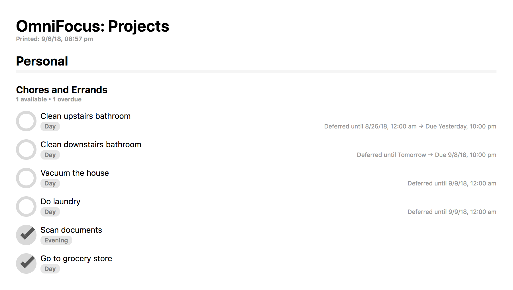

# OmniFocus HTML Export

OmniFocus 2 and 3 for Mac supports custom templates for both HTML export and printing. I've created one designed to more closely resemble the in-app UI.

## Installation Instructions

1. [Download this file](https://raw.githubusercontent.com/deaghean/omnifocus-html-export/master/HTMLExportTemplate.html). You can save it from your browser as HTML.
2. Depending on your version of OmniFocus, place the file in either the `~/Library/Containers/com.omnigroup.OmniFocus2/Data/Library/Application Support/OmniFocus` or `~/Library/Containers/com.omnigroup.OmniFocus3/Data/Library/Application Support/OmniFocus` directories.

Once that's done, printing and HTML exports will use the template. Feedback and suggestions are welcome: [josh@josh-hughes.com](mailto:josh@josh-hughes.com). Also, be sure to check out my [custom perspective icon project](https://omnifocusicons.josh-hughes.com).