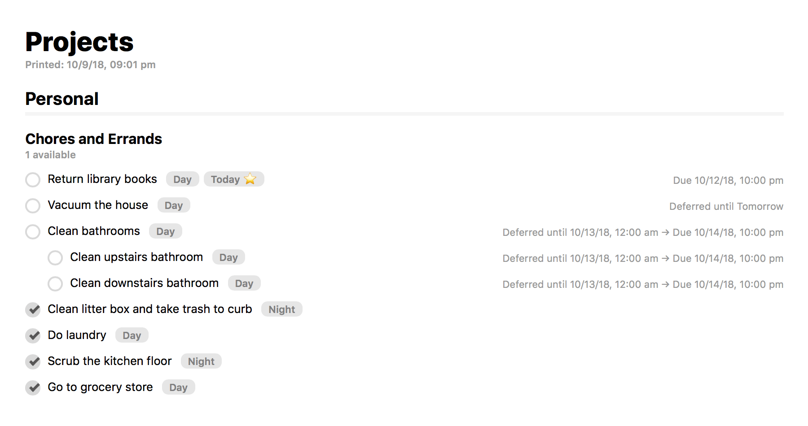

# OmniFocus HTML Export

OmniFocus 2 and 3 for Mac supports custom templates that are used for both HTML export and printing. I've created one designed to more closely resemble the in-app UI.

## Standard Version

### Installation Instructions

1. [Download this file](https://raw.githubusercontent.com/deaghean/omnifocus-html-export/master/standard/HTMLExportTemplate.html). You can save it from your browser as HTML. The file needs to be named `HTMLExportTemplate.html`.
2. Depending on your version of OmniFocus, place the file in either the `~/Library/Containers/com.omnigroup.OmniFocus2/Data/Library/Application Support/OmniFocus` or `~/Library/Containers/com.omnigroup.OmniFocus3/Data/Library/Application Support/OmniFocus` directories.

Once that's done, printing and HTML exports will use the template.

## Compact Version

_Many thanks to Kennon Bickhart for his contributions to this version of the layout. [His version](https://github.com/kennonb/omnifocus-html-export) is a little bit different (even more compact!), so it's worth checking out._

### Installation Instructions

Same as above, but you should [download this file instead](https://raw.githubusercontent.com/deaghean/omnifocus-html-export/master/compact/HTMLExportTemplate.html)

----

Feedback and suggestions are welcome: [josh@josh-hughes.com](mailto:josh@josh-hughes.com). Also, be sure to check out my [custom perspective icon project](https://omnifocusicons.josh-hughes.com).